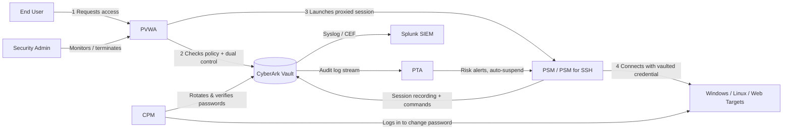

## Lab Architecture



*Vault is the system of record for every credential; PVWA is the only thing users touch directly; PSM is the only thing that ever talks to a target system with the real password.*

---

## What I Did

### 1. Configured Full Session Recording (RDP, SSH, Web) with PSM + Dual Control & Justification

**Scenario:** Compliance requires that every privileged session be recorded, and that two people are involved any time someone connects to a Tier-0 account.

**Steps:**

1. **Created Safes** to segregate credentials by platform type: `WinServers-Safe`, `LinuxServers-Safe`, and `WebApps-Safe`. Added the appropriate Safe Members (the account owner group, the CPM service account, and a separate `Approvers` group used later for dual control).
2. **Onboarded accounts** into PVWA (`Accounts → Add Account`) using the matching out-of-the-box platforms: `WinServerLocal` for a local admin account, `UnixSSH` for a Linux root account, and a web platform (`PSM-WebForm`-based) for a sample internal portal login.
3. Confirmed each platform's **Connection Component** is set to PSM (`PSM-RDP`, `PSM-SSH`, `PSM-WebForm`), so any connection is automatically proxied rather than allowing direct "show password" access.
4. In **Master Policy → Session Management**, enabled:
   - *Require privileged session monitoring and isolation*
   - *Record and save session activity*
   - *Require PSM for SSH ON for UNIX-based machines* (for command-level text logging, used later in analytics)
5. Verified recordings landed under **PVWA → Monitor → Recordings**, and played back a finished RDP and SSH session to confirm full video playback.
6. Enabled **dual control**: in **Master Policy → Privileged Access Workflows**, turned on *Require dual control password access approval*, pointed it at the `Approvers` safe group, and set the number of required confirmers to 1.
7. Enabled **justification**: turned on *Require users to specify reason for access* in the same workflow section, so every connection request needs a free-text reason logged against it.
8. **Tested the full workflow** end to end: requested access as a standard user → request sat in "Pending" until an approver confirmed it in PVWA → had to enter a justification → only then was the PSM connect button enabled.

<!-- img/01_pvwa_add_account.png -->
*Screenshot: Onboarding a privileged account in PVWA with the PSM connection component selected.*

<!-- img/02_session_recording_playback.png -->
*Screenshot: Recorded PSM session playback under Monitor → Recordings.*

<!-- img/03_dual_control_request.png -->
*Screenshot: A pending access request awaiting dual-control confirmation, with the justification field filled in.*

---

### 2. Enabled Session Isolation, Live Monitoring & Termination in PVWA

**Scenario:** The SOC needs to be able to watch a privileged session as it happens and kill it immediately if something looks wrong — without having to ask the end user to stop.

**Steps:**

1. Confirmed **session isolation** is in effect: because PSM is the connection component, the end user's laptop never receives the actual RDP/SSH credential — PSM authenticates to the target on the user's behalf, so the user's endpoint is never a credential-theft target.
2. Opened **PVWA → Monitor → Active Sessions** to view every privileged session currently in progress in real time (user, target, start time, account, client IP).
3. Selected a live SSH session and used the **Monitor** action to join it in real time, watching keystrokes as the user typed — confirming live monitoring works without interrupting the session.
4. Tested **Suspend Session** on a live RDP session — the target user's screen froze immediately with a CyberArk notice, and the security admin could resume it.
5. Tested **Terminate Session** on a different session — the connection was forcibly dropped, and the action plus the admin's name and timestamp was written to the audit log.
6. Confirmed both actions are logged under **Reports → Privileged Accounts Activity**, including who terminated/suspended the session and when.

<!-- img/04_active_sessions_dashboard.png -->
*Screenshot: PVWA Active Sessions dashboard showing live RDP/SSH/Web sessions in progress.*

<!-- img/05_live_session_monitor.png -->
*Screenshot: Security admin watching a live SSH session via the Monitor action.*

<!-- img/06_session_terminate_confirm.png -->
*Screenshot: Terminate Session confirmation dialog and the resulting audit log entry.*

---

### 3. Implemented Privileged Session Analytics — Detecting Anomalous SSH Commands

**Scenario:** A privileged session can be perfectly "authorized" and still be malicious — e.g., someone downloading and executing an unknown script during a legitimate SSH session. The security team needs automated detection, not just video review.

**Steps:**

1. Confirmed **PSM for SSH command-level logging** was enabled on the `UnixSSH` platform (Master Policy → *Require PSM for SSH ON for UNIX-based machines*), which logs every command typed in addition to the video recording — this text log is what PTA actually analyzes.
2. Connected **PTA (Privileged Threat Analytics)** to the Vault so it continuously ingests Vault audit events and PSM session data.
3. Reviewed PTA's built-in detections relevant to this scenario, in particular analytics that flag **suspicious activity within a privileged session** (e.g., unusual commands, unmanaged/unexpected privilege escalation, and behavior that deviates from a user's normal pattern).
4. Configured PTA's response action for high-risk detections to **automatically suspend or terminate the PSM session**, rather than only generating an alert after the fact.
5. **Ran a controlled test:** during an SSH PSM session, executed a sequence of flagged-style commands (downloading a remote script and changing it to executable, e.g. `wget`/`curl` followed by `chmod +x`) to simulate suspicious behavior.
6. Confirmed the activity surfaced in the **PTA dashboard** with a risk score, the offending command text, and a direct link to jump to that exact point in the session recording.
7. Documented the alert-to-response time: from command execution to PTA flagging the session.

<!-- img/07_pta_dashboard_alert.png -->
*Screenshot: PTA dashboard showing a flagged session with risk score and command detail.*

<!-- img/08_pta_session_link.png -->
*Screenshot: Jumping from a PTA alert directly to the relevant timestamp in the PSM recording.*

---

### 4. Set Up Automatic Password Rotation Policies for Different Account Types

**Scenario:** Not every privileged account can be treated the same way — a domain admin account is far higher risk than a network device account, and rotating a production database password at 2 PM on a Tuesday would be a problem. Each account type needs its own rotation cadence, change window, and verification method.

| Account Type | Platform | Rotation Interval | Change Window | Verification Method |
|---|---|---|---|---|
| Windows Local Admin | `WinServerLocal` | Every 7 days | Anytime | CPM logon verification (WinRM) |
| Windows Domain Admin | `WinDomain` | Every 1 day | 02:00–04:00 maintenance window only | CPM verify + **reconcile** against a dedicated reconciliation account |
| Linux/Unix Root (SSH) | `UnixSSH` | Every 14 days | Weekend maintenance window | CPM SSH logon test + custom verification script |
| Database Service Account | `Oracle` / `MSSQL` | Every 30 days | Scheduled app-maintenance window | Custom script tests DB connectivity post-change |
| Network Device (Cisco) | `Cisco` | Every 90 days | Low-traffic overnight window | CPM SSH/Telnet connectivity test |

**Steps:**

1. **Duplicated** the relevant out-of-the-box platforms (rather than editing the originals) so each account type could have its own independent policy — e.g., cloned `WinServerLocal` and `WinDomain` separately.
2. On each platform's **CPM (Automatic Password Management)** tab, configured:
   - *Days until password expiration* (the rotation interval from the table above)
   - *Allowed time to change password* — restricted to the maintenance window for the higher-risk platforms (domain admin, database, network device), left open for lower-risk local accounts
   - Password complexity rules under the platform's **Password Policy** tab, tailored per target OS/app requirements
3. For the **Windows Domain Admin** platform, configured a **reconciliation account** (a second, highly-restricted domain account CPM can use to reset the managed password if verification ever fails) — this is what makes domain admin rotation self-healing instead of needing manual intervention.
4. Attached a **custom verification step** so CPM doesn't just trust that the password change command succeeded — it actually logs back in with the new credential immediately afterward and confirms access. Example used for the Linux platform (illustrative, simplified):

   ```bash
   #!/bin/bash
   # CPM custom verification wrapper - Linux/SSH platform
   # Args: $1 = target host, $2 = username, $3 = new password (passed securely by CPM)
   TARGET_HOST="$1"
   TARGET_USER="$2"
   NEW_PASS="$3"

   sshpass -p "$NEW_PASS" ssh -o StrictHostKeyChecking=no "$TARGET_USER@$TARGET_HOST" "echo VERIFY_OK"

   if [ $? -eq 0 ]; then
       echo "Verification succeeded for $TARGET_USER@$TARGET_HOST"
       exit 0
   else
       echo "Verification FAILED for $TARGET_USER@$TARGET_HOST"
       exit 1
   fi
   ```

   And the Windows equivalent used for local admin verification:

   ```powershell
   # CPM custom verification wrapper - Windows local admin platform
   param(
       [string]$TargetHost,
       [string]$Username,
       [securestring]$NewPassword
   )

   $cred = New-Object System.Management.Automation.PSCredential($Username, $NewPassword)
   try {
       Invoke-Command -ComputerName $TargetHost -Credential $cred -ScriptBlock { whoami } -ErrorAction Stop
       Write-Output "Verification succeeded for $Username on $TargetHost"
       exit 0
   } catch {
       Write-Output "Verification FAILED for $Username on $TargetHost: $_"
       exit 1
   }
   ```

5. Ran **manual Change, Verify, and Reconcile** actions from PVWA for each platform to confirm each worked before letting CPM run on its own schedule.
6. Let CPM run on schedule overnight, then confirmed the next morning that:
   - The Vault showed a new "last changed" timestamp for each account
   - The audit log showed a successful Change + Verify event for every account
   - Logging into each target manually with the new vaulted password worked

<!-- img/09_platform_cpm_settings.png -->
*Screenshot: CPM "Automatic Password Management" tab showing rotation interval and allowed change-time window.*

<!-- img/10_reconcile_account_config.png -->
*Screenshot: Reconciliation account configured on the Windows Domain Admin platform.*

<!-- img/11_password_change_audit.png -->
*Screenshot: Vault audit log confirming a successful scheduled password change and verification.*

---

### 5. Implemented Advanced Auditing — SIEM Integration & Custom Reports

**Scenario:** The SOC shouldn't have to log into PVWA to find out something happened — privileged account events need to show up in the SIEM in real time, alongside everything else they monitor.

**Steps:**

1. Configured the **Vault's syslog forwarding** (`DBParm.ini`) to point at the Splunk syslog/HEC listener — set the SIEM server IP, port, and protocol, and pointed the Vault at its `translator.xml` mapping file, which converts CyberArk's internal audit codes into a SIEM-friendly format (CEF) before sending.
2. In Splunk, confirmed events were arriving from the Vault and built a dedicated **index/source type** for CyberArk PAM events to keep them separate from other log sources.
3. Built **Splunk alerts/correlation searches** for the events the SOC cares about most:
   - Failed logon attempts to the Vault/PVWA
   - A privileged account password change failure (signals CPM couldn't rotate — needs investigation)
   - A session termination or suspend action (security admin had to intervene)
   - Access to a Tier-0 safe outside of the approved dual-control workflow
4. Set those correlation searches to fire as **real-time alerts** (email/Slack-style notification) rather than waiting for a scheduled search.
5. Built **custom audit reports inside PVWA** (`Reports`) for things the SOC and auditors ask for on a recurring basis:
   - **Privileged Accounts Inventory** — every onboarded account, its platform, and last rotation date
   - **Activity Log report** — filtered by safe, user, and date range, scheduled to email weekly to the security manager
6. **Validated end to end:** performed a real privileged action (a session termination) in PVWA, then confirmed the matching event appeared in the Splunk dashboard and triggered the configured alert.

<!-- img/12_splunk_dashboard.png -->
*Screenshot: Splunk dashboard showing ingested CyberArk Vault audit events.*

<!-- img/13_splunk_alert_fired.png -->
*Screenshot: Real-time Splunk alert triggered by a privileged session termination event.*

<!-- img/14_pvwa_custom_report.png -->
*Screenshot: Custom PVWA Activity Log report scheduled for weekly delivery.*

---

## Key Takeaways

- **Session Isolation & Recording** — PSM means the end user's machine never holds the real credential, and every RDP/SSH/Web session is fully recorded for evidence and review.
- **Separation of Duties** — Dual control and justification workflows turn "anyone with safe access can connect" into a controlled, auditable, two-person process.
- **Real-Time Incident Response** — Live monitoring and the ability to suspend or terminate a session immediately closes the gap between "something looks wrong" and "the session is stopped."
- **Behavioral Analytics, Not Just Recording** — PTA turns passive session recordings into active detection by flagging risky commands and behavior as they happen, not days later during a video review.
- **Risk-Based Credential Lifecycle Management** — Not every account needs the same rotation cadence; matching change windows and verification methods to account risk (domain admin vs. network device) avoids both security gaps and production outages.
- **Verification, Not Assumption** — A password "change" that isn't independently verified is just a guess; custom verification scripts confirm the new credential actually works before CPM trusts it.
- **Auditability Beyond the Vault** — Forwarding events to a SIEM and building custom reports means privileged activity is visible to the SOC and auditors without anyone having to remember to go check PVWA.

---

## Suggested Repository Structure

```
cyberark-pam-session-monitoring-lab/
├── README.md
├── img/
│   ├── 01_pvwa_add_account.png
│   ├── 02_session_recording_playback.png
│   ├── 03_dual_control_request.png
│   ├── ... (one per placeholder above)
└── scripts/
    ├── verify-linux-account.sh
    └── verify-windows-account.ps1
```

## Lab Prerequisites (if you're reproducing this)

- CyberArk PAM Self-Hosted v12.6 installation media/trial license
- At least 3–4 Windows Server 2019/2022 VMs (Vault, PVWA+CPM, PSM) — can be consolidated onto fewer VMs for a lab
- One Linux VM for PSM for SSH / PTA, plus one or two Linux target machines
- A Windows domain controller if you want to test domain admin rotation/reconciliation
- A Splunk Free or trial instance for the SIEM integration piece
- This should be built in an **isolated lab/sandbox network** — never point a learning environment at production credentials or real domain admin accounts

---

*This project maps to the "Implement privileged session monitoring, auditing, and password rotation" track of a CyberArk PAM learning path, and is intended as a beginner-friendly, scenario-based portfolio piece.*
