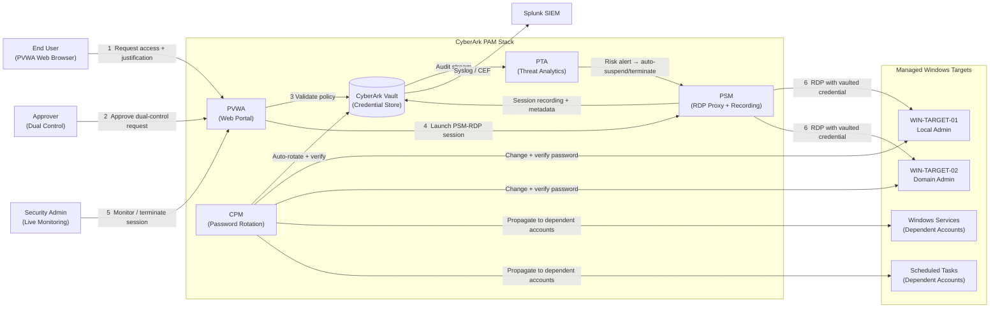

# CyberArk PAM (Self-Hosted v12.6) — PSM-RDP Session Monitoring, Auditing & Password Rotation Lab

*A hands-on home-lab project implementing RDP session recording, dual control workflows, live session monitoring and termination, PTA-based RDP session analytics, automated password rotation (including Windows Service and Scheduled Task dependent accounts), and SIEM-integrated auditing — all through the PSM-RDP connection component in CyberArk PAM Self-Hosted v12.6.*

> 📌 **How to use this doc:** Follow each numbered section in your own lab environment. As you complete each step, replace the `img/` screenshot placeholders shown in each section with your own screenshots. The suggested repo folder structure at the bottom shows how to organise and publish this to GitHub when you're done.

---

## Scenario

You're the newly hired PAM engineer at a mid-sized financial services firm. An internal audit just flagged five specific control gaps around privileged Windows access:

1. Privileged RDP sessions to servers and workstations are **not recorded** — there is no evidence trail if a domain admin does something destructive.
2. Any user with safe access can connect to a privileged account **without a second approver or any stated reason** — there is no separation of duties.
3. The security team has **no way to observe a live RDP session** or terminate it in real time if it looks suspicious.
4. Privileged Windows passwords — including accounts running Windows Services and Scheduled Tasks — **have never been rotated**, some not for years.
5. Privileged account activity is **invisible to the SOC** because nothing is forwarded to the SIEM.

Your job: configure CyberArk PAM Self-Hosted v12.6 to close every one of these gaps, using PSM-RDP as the exclusive session management channel for all Windows privileged access.

---

## Overview

This lab onboards Windows privileged accounts — local admins, domain admins, Windows Service accounts, and Windows Scheduled Task accounts — then walks through five hands-on projects: full RDP session recording with dual control and justification; live session monitoring and forced termination through PVWA; PTA-based RDP session analytics for detecting anomalous privileged access behaviour; automated, risk-tiered password rotation with custom verification scripts and dependent account handling; and SIEM-integrated auditing with real-time alerts and scheduled reports.

---

## Lab Environment

| Component | Role | OS | IP |
|---|---|---|---|
| CyberArk Vault | Encrypted credential store | Windows Server 2019 | 192.168.100.10 |
| PVWA + CPM | Web portal + Password rotation engine | Windows Server 2019 | 192.168.100.20 |
| PSM | RDP proxy and session recording host | Windows Server 2019 | 192.168.100.30 |
| PTA | Privileged Threat Analytics | RHEL 8 (or Rocky 8) | 192.168.100.40 |
| Splunk (SIEM) | Log ingestion + real-time alerting | Windows Server 2019 | 192.168.100.50 |
| DC01 | Domain Controller (pitythefool.com) | Windows Server 2019 | 192.168.100.11 |
| WIN-TARGET-01 | Managed Windows target (local admin) | Windows Server 2019 | 192.168.100.60 |
| WIN-TARGET-02 | Managed Windows target (domain admin) | Windows Server 2019 | 192.168.100.61 |

---

## Tools & Components Used

- **CyberArk Vault** — the encrypted digital vault that stores every privileged credential at rest; all other components authenticate to the Vault rather than directly to each other
- **PVWA (Password Vault Web Access)** — the web portal used by end users to request access, by approvers to confirm dual-control requests, and by security admins to monitor and terminate live sessions
- **CPM (Central Policy Manager)** — the automated rotation engine that changes, verifies, and reconciles privileged passwords on schedule; also handles dependent account types (Services, Scheduled Tasks)
- **PSM (Privileged Session Manager)** — acts as an RDP proxy between the end user and the target Windows machine; the user connects to PSM, PSM connects onward using the vaulted credential, the user never sees the real password, and the full session is recorded
- **PTA (Privileged Threat Analytics)** — continuously analyses Vault events and PSM session metadata to detect anomalous privileged access behaviour and automatically respond to high-risk sessions
- **Splunk (Free/Trial)** — SIEM used to receive CyberArk Vault audit events via syslog/CEF and surface real-time alerts to the SOC
- **PowerShell** — used for custom CPM verification scripts and dependent account management

---

## Architecture



*PSM is the only component that ever touches a target machine with the real credential. The end user's machine receives a standard RDP session to the PSM host — not to the target — so the vaulted password is never exposed to the endpoint.*

---

## What I Did

### 1. Configured Full RDP Session Recording with PSM and Enabled Dual Control + Justification Workflows

**Scenario:** Compliance requires that every privileged RDP session be recorded and that a second authorised person must approve any connection to a Tier-0 account before it is allowed.

**Steps:**

1. Created two **Safes** in PVWA to separate account types by risk tier:
   - `T0-DomainAdmins-Safe` — for domain admin accounts (Tier 0, highest risk)
   - `T1-LocalAdmins-Safe` — for Windows local administrator accounts (Tier 1)

   For each Safe, added the following Safe Members with appropriate permissions:
   - `CyberArk Vault Admins` AD group — full Safe Owner rights
   - `svc_cyberark_cpm` — CPM service account with the minimum permissions required for automated rotation (Store Password, Retrieve Password, Initiate CPM password operations)
   - `CyberArk Safe Managers` AD group — Manage Safe permissions
   - `CyberArk Auditors` AD group — List + Retrieve (read-only) for audit purposes
   - `T0-Approvers` AD group — *Authorize password requests* permission only — this is the group CPM will require confirmation from under dual control

2. Onboarded privileged accounts into each Safe using `Accounts → Add Account` in PVWA:
   - A **local administrator** account on WIN-TARGET-01 using the `WinServerLocal` platform
   - A **domain administrator** account in pitythefool.com using the `WinDomain` platform

   In both cases, set the **Connection Component** to `PSM-RDP` so all connections are automatically proxied through PSM and the user is never offered a "Show Password" / direct connect option outside the PSM channel.

3. In **PVWA → Policies → Master Policy → Session Management**, enabled the following rules:
   - *Require privileged session monitoring and isolation* — enforces that all connections go through PSM
   - *Record and save session activity* — enables full video recording of every RDP session

4. Navigated to a completed RDP session under **PVWA → Monitor → Recordings** and played it back to confirm the full session was captured with correct timestamps, account name, and target.

5. Enabled **dual control** for the `T0-DomainAdmins-Safe` specifically (since local admin accounts are lower risk, this is applied only at the higher tier):
   - Opened the Safe's properties and enabled *Require dual control password access approval*
   - Set the number of required authorisers to **1**, from the `T0-Approvers` group

6. Enabled **justification** across both Safes:
   - In **Master Policy → Privileged Access Workflows**, turned on *Require users to specify reason for access* so every access request must carry a logged free-text business reason

7. **Tested the full flow end-to-end:**
   - Logged in as a standard user and initiated an RDP connection to a domain admin account → request status showed "Pending Approval"
   - Logged in as an approver and confirmed the pending request in **PVWA → Requests**
   - Returned to the requesting user's session, entered a justification reason, and confirmed the PSM-RDP connect button was now active
   - Connected via PSM-RDP and verified the full session appeared under **Monitor → Recordings** on completion

<!-- img/01_pvwa_add_account_rdp.png -->
*Screenshot: Adding a Windows local admin account to PVWA with PSM-RDP selected as the connection component.*

<!-- img/02_safe_members_dual_control.png -->
*Screenshot: Safe Members configuration for T0-DomainAdmins-Safe, showing the T0-Approvers group with "Authorize password requests" permission enabled.*

<!-- img/03_session_recording_playback.png -->
*Screenshot: A completed PSM-RDP session playing back under Monitor → Recordings, showing the session timeline, account used, and target machine.*

<!-- img/04_dual_control_pending_request.png -->
*Screenshot: The access request sitting in "Pending Approval" state, with the justification field populated, and the approver's confirmation view alongside it.*

---

### 2. Enabled Session Isolation, Live Monitoring, and Termination Capabilities in PVWA

**Scenario:** The SOC needs to watch a live privileged RDP session as it happens and be able to terminate it instantly if the activity looks malicious — without needing to coordinate with the user or log into the target server directly.

**Steps:**

1. Confirmed **session isolation** is working as expected: opened a PSM-RDP session as a test user and simultaneously checked on another machine that there was no way to extract the domain admin password from the RDP client — the end user's RDP connection terminates at the PSM host, and PSM makes the onward connection to the target. The credential never leaves the Vault.

2. Opened **PVWA → Monitor → Active Sessions** to see the live session dashboard:
   - Confirmed the active RDP session appeared immediately with: the username who initiated it, the target machine, the privileged account being used, the session start time, and the originating client IP
   - Noted that sessions appear regardless of which PVWA node the user connected through (in a load-balanced environment)

3. Selected the live session and clicked **Monitor** to join it — confirmed the security admin could observe every mouse movement and keystroke on the remote desktop in real time, with a slight lag, without interrupting the user's session.

4. Tested **Suspend Session**:
   - While monitoring a live RDP session, clicked Suspend
   - Confirmed the target user's screen immediately froze with a CyberArk "session suspended" overlay
   - Confirmed that resuming the session from the PVWA admin view restored the user's RDP session exactly where it was left

5. Tested **Terminate Session**:
   - Initiated a second test RDP session and terminated it from the Active Sessions dashboard
   - Confirmed the RDP session dropped immediately on the user's client with a disconnection message
   - Confirmed the terminate event appeared in the audit log with: the admin who terminated it, the exact timestamp, the target, and the account

6. Navigated to **PVWA → Reports → Privileged Accounts Activity** and confirmed both the suspend and terminate events were logged there alongside the reason code, so they are available for audit review.

<!-- img/05_active_sessions_dashboard.png -->
*Screenshot: PVWA Active Sessions dashboard showing a live PSM-RDP session with user, target, account, and start time visible.*

<!-- img/06_live_session_monitoring.png -->
*Screenshot: The security admin's view of a live PSM-RDP session using the Monitor action — the user's desktop activity is visible in real time.*

<!-- img/07_session_suspend_terminate.png -->
*Screenshot: The Suspend and Terminate action buttons available on an active session, and the resulting audit log entry showing who terminated the session and when.*

---

### 3. Implemented Privileged Session Analytics — Detect Anomalous RDP Sessions via PTA

**Scenario:** A privileged RDP session can be fully "authorised" and still be dangerous — an account logging in at 3 AM from an unusual IP, or an admin doing an unusual number of RDP hops to different servers in quick succession, should be flagged automatically without requiring someone to review every recording.

**What PTA does for RDP sessions (v12.6):**
PTA continuously ingests audit events from the Vault and session metadata from PSM. For RDP, it detects anomalous behaviour at the *session pattern* level — it does not provide command-level text logging for RDP (that capability applies to PSM for SSH). The behaviours PTA flags for RDP privileged sessions include:

| PTA Detection | What It Looks For |
|---|---|
| **Anomalous access time** | A privileged account used at hours that deviate significantly from its historical usage pattern |
| **Anomalous source IP** | An RDP session to a privileged account originating from an IP the account has never been used from before |
| **Excessive frequency** | An unusually high number of RDP sessions to multiple targets within a short time window |
| **Unmanaged account RDP** | Direct RDP to a target server using credentials not stored in the Vault (PTA detects this by monitoring Windows Security event logs) |
| **Bypass of PAM controls** | A privileged account accessed directly without going through the PSM proxy |

**Steps:**

1. Verified that **PTA was connected to the Vault** during installation by confirming the PTA service account appeared in the Vault's Users list and that the PTA service was reporting as healthy in the PTA admin console.

2. Confirmed PTA was ingesting **Windows Security event log** data from the target servers (WIN-TARGET-01, WIN-TARGET-02) — this is what allows PTA to detect direct/unmanaged RDP bypassing the PSM proxy. PTA collects these via a WinCollect/log forwarder agent installed on the targets.

3. Reviewed PTA's default detection policies under the **PTA Administration Console → Security Events** to confirm the anomalous-access-time, anomalous-source-IP, and unmanaged-privileged-account detections were all enabled.

4. Configured PTA's **automatic response action** for high-risk RDP session detections:
   - For *Critical* risk level: automatically terminate the PSM session
   - For *High* risk level: automatically suspend the PSM session and generate an alert for a human to review

5. **Ran a controlled test for anomalous access time:**
   - Identified a privileged account that had only ever been used during business hours
   - Initiated a PSM-RDP session to that account outside its normal hours window (e.g., a Sunday morning)
   - Confirmed the activity appeared in the **PTA Dashboard → Security Events** with a risk score, the account name, the deviation reason ("access outside normal hours"), and a direct link to the PSM recording for that session

6. **Ran a controlled test for unmanaged RDP (PAM bypass detection):**
   - From a test machine, used a known local admin credential to RDP directly to WIN-TARGET-02 *without* going through PVWA/PSM
   - Confirmed PTA flagged this within a short delay as an "Unmanaged Privileged Account" event, as it detected an RDP logon to a privileged account that did not originate from the PSM host's IP

7. Confirmed PTA's **direct link from alert to recording** — clicking the alert in the PTA dashboard jumped directly into the PSM session recording for the flagged session, rather than requiring a manual search in PVWA.

<!-- img/08_pta_dashboard_rdp_alert.png -->
*Screenshot: PTA dashboard showing a flagged RDP session — anomalous access time detection, with risk score and the account and target details.*

<!-- img/09_pta_unmanaged_rdp_detection.png -->
*Screenshot: PTA Security Events view showing a detected unmanaged privileged RDP logon that bypassed the PSM proxy.*

<!-- img/10_pta_recording_link.png -->
*Screenshot: Navigating from a PTA alert directly into the corresponding PSM-RDP session recording.*

---

### 4. Set Up Automatic Password Rotation Policies for Different Windows Account Types — Including Dependent Accounts

**Scenario:** Windows Service accounts and Scheduled Task accounts have their passwords embedded in the Windows Services control panel and Task Scheduler respectively. If CPM rotates the parent account without also updating those dependent registrations, the service or task breaks. Each account type also needs its own risk-appropriate change window.

**Account Types and Rotation Policy:**

| Account Type | Platform | Rotation Interval | Change Window | Verification Method | Dependent Type? |
|---|---|---|---|---|---|
| Windows Local Admin | `WinServerLocal` | Every 7 days | Anytime | CPM WinRM logon test | No |
| Windows Domain Admin | `WinDomain` | Every 1 day | 02:00–04:00 only | CPM logon test + reconciliation account | No |
| Windows Service Account | `WinServerLocal` | Every 30 days | Weekend 01:00–03:00 | CPM WinRM logon + service restart test | **Yes** — parent is the domain account running the service |
| Windows Scheduled Task Account | `WinServerLocal` | Every 30 days | Weekend 01:00–03:00 | CPM verify + task execution test | **Yes** — parent is the account set in Task Scheduler |

**Understanding Dependent Accounts in CyberArk:**
A *dependent account* is an account whose password exists in more than one place — for example, a domain service account whose password is stored in the Vault *and* also embedded inside a Windows Service registration. When CPM rotates the password, it must update both the Vault record *and* every location where that password is registered. In CyberArk, you tell the system about these additional locations by linking them as dependents on the parent account.

**Steps:**

1. **Duplicated the out-of-the-box platforms** rather than editing the defaults — this preserves the originals as a fallback:
   - Cloned `WinServerLocal` → renamed to `Lab-WinLocalAdmin`
   - Cloned `WinDomain` → renamed to `Lab-WinDomainAdmin`
   
   This also allows each account type to have its own independent CPM policy without one change affecting all accounts.

2. On each platform's **CPM (Automatic Password Management)** tab, configured:
   - *Days until password expiration* — matched to the rotation interval in the table above
   - *Allowed change window* — restricted to the maintenance window for domain admin and service accounts; left unrestricted for local admin accounts

3. Configured the **domain admin platform with a reconciliation account:**
   - Added `svc_cyberark_recon` as the reconciliation account on the `Lab-WinDomainAdmin` platform
   - This account has the minimum AD permissions needed to reset the managed domain admin password (typically: "Reset Password" delegation on the target OU)
   - If CPM ever fails to verify the new domain admin password, it automatically falls back to the reconciliation account to re-set it — self-healing without manual intervention

4. **Onboarded the Windows Service Account as a dependent account:**
   - First, onboarded the parent domain account (`svc_webapp_runner`) into the `T1-LocalAdmins-Safe` using the `Lab-WinLocalAdmin` platform
   - Then, on the account's detail page in PVWA, opened **Linked Accounts → Add Dependent Account**
   - Specified: target machine (`WIN-TARGET-01`), the Windows Service name that runs as this account (`AppService`), and the platform type (`WindowsService`)
   - CPM now knows that after rotating `svc_webapp_runner`, it must also update the password stored in the `AppService` Windows Service registration on `WIN-TARGET-01`

5. **Onboarded the Windows Scheduled Task Account as a dependent account** using the same approach:
   - Linked the Scheduled Task account to its parent via **Linked Accounts → Add Dependent Account**
   - Specified: target machine, Scheduled Task name, and platform type (`WindowsScheduledTask`)

6. Added **custom PowerShell verification scripts** to confirm the new password actually works before CPM marks the rotation as complete:

   **Local/Domain Admin verification (WinRM-based):**
   ```powershell
   # CPM Custom Verification Script - Windows Admin Account
   # Called by CPM after password change; args passed securely by CPM
   param(
       [string]$TargetHost,
       [string]$Username,
       [securestring]$NewPassword
   )

   $cred = New-Object System.Management.Automation.PSCredential($Username, $NewPassword)
   try {
       $result = Invoke-Command -ComputerName $TargetHost -Credential $cred `
           -ScriptBlock { "$env:USERNAME on $env:COMPUTERNAME" } `
           -ErrorAction Stop
       Write-Output "Verification PASSED: $result"
       exit 0
   } catch {
       Write-Output "Verification FAILED for $Username on ${TargetHost}: $_"
       exit 1
   }
   ```

   **Windows Service Account verification (checks service still running after password change):**
   ```powershell
   # CPM Custom Verification Script - Windows Service Dependent Account
   param(
       [string]$TargetHost,
       [string]$ServiceName,
       [string]$Username,
       [securestring]$NewPassword
   )

   $cred = New-Object System.Management.Automation.PSCredential($Username, $NewPassword)
   try {
       # Step 1: Verify the account credential itself is valid
       Invoke-Command -ComputerName $TargetHost -Credential $cred `
           -ScriptBlock { whoami } -ErrorAction Stop | Out-Null

       # Step 2: Verify the Windows Service is in Running state after the update
       $svc = Invoke-Command -ComputerName $TargetHost -Credential $cred -ScriptBlock {
           param($svcName)
           Get-Service -Name $svcName
       } -ArgumentList $ServiceName -ErrorAction Stop

       if ($svc.Status -eq 'Running') {
           Write-Output "Verification PASSED: $ServiceName is Running on $TargetHost"
           exit 0
       } else {
           Write-Output "Verification FAILED: $ServiceName status is '$($svc.Status)' on $TargetHost"
           exit 1
       }
   } catch {
       Write-Output "Verification FAILED: $_"
       exit 1
   }
   ```

7. Ran **manual Change → Verify → Reconcile** actions in PVWA for each account type before allowing CPM's automatic schedule to take over — this confirms each step works in isolation before handing off to automation.

8. After CPM ran its first automated cycle, confirmed:
   - Each account's *Last Changed* timestamp updated in PVWA
   - The audit log showed a successful `Change` + `Verify` event (and `Reconcile`, where applicable) for every account
   - Service accounts' Windows Services and Scheduled Tasks were still running on the target machines after rotation

<!-- img/11_platform_cpm_change_window.png -->
*Screenshot: CPM Automatic Password Management tab on the Lab-WinDomainAdmin platform — rotation interval set to 1 day, change window restricted to 02:00–04:00.*

<!-- img/12_reconcile_account_linked.png -->
*Screenshot: Reconciliation account (svc_cyberark_recon) linked on the domain admin platform.*

<!-- img/13_dependent_service_account.png -->
*Screenshot: A Windows Service Account linked as a dependent account in PVWA — showing the parent account, target machine, and the Windows Service name.*

<!-- img/14_scheduled_task_dependent.png -->
*Screenshot: A Scheduled Task account linked as a dependent account, showing the task name and target machine.*

<!-- img/15_cpm_rotation_audit_log.png -->
*Screenshot: Vault audit log confirming successful automated Change, Verify, and dependent account propagation for a service account.*

---

### 5. Implemented Advanced Auditing — SIEM Integration for Real-Time Alerts and Custom Audit Reports

**Scenario:** The SOC has no visibility into privileged RDP activity. Events need to stream into Splunk in real time so the team can alert on suspicious patterns without manually checking PVWA, and auditors need structured reports on demand.

**Steps:**

1. **Configured Vault syslog forwarding** to Splunk:
   - Opened `DBParm.ini` on the Vault server and configured the syslog settings — Splunk's IP (192.168.100.50), port, and CEF (Common Event Format) output
   - The Vault ships with a `Translator.xml` file that maps internal CyberArk audit event codes to human-readable CEF field names — this translation happens at the Vault before the event leaves, so Splunk receives labelled, structured events rather than raw internal codes
   - Restarted the Vault service to apply the configuration

2. In Splunk, confirmed events were arriving from the Vault:
   - Created a dedicated index `cyberark_pam` and source type `cyberark:vault:cef` to keep CyberArk events separate from other log sources
   - Confirmed events were arriving with recognisable field names: `Account_Name`, `Safe_Name`, `Activity`, `Reason`, `Source_Machine`, `Session_ID`

3. Built the following **Splunk correlation searches** for the SOC, each configured as a **real-time alert**:

   | Alert | Trigger Condition | Severity |
   |---|---|---|
   | Vault logon failure spike | 5+ failed Vault/PVWA logon events from one IP in 5 minutes | High |
   | CPM rotation failure | Any `CPM Password Change` event with status `Failed` | High |
   | PSM session terminated by admin | Any `Terminate Session` audit event logged by a security admin account | Medium |
   | Privileged access outside dual control | Access to a Tier-0 Safe without a corresponding approval event in the same session window | Critical |
   | Account accessed outside approved hours | PSM-RDP session started for a Tier-0 account between 18:00–06:00 or on a weekend | High |

4. Set each alert's action to notify the SOC via email/webhook — verified by triggering each condition deliberately in the lab and confirming the alert fired in Splunk's Alert Manager within a few minutes.

5. Built **custom PVWA audit reports** for recurring audit use cases (under **PVWA → Reports**):

   - **Privileged Account Inventory report** — lists every onboarded account, its platform, Safe, and the date of its last password change; used by the audit team quarterly to confirm rotation compliance
   - **Activity Log report** — filtered to Tier-0 Safes only, showing every access request, who approved it, the justification entered, and whether a session was recorded; scheduled to email the security manager every Monday morning

6. **End-to-end validation:**
   - Performed a real privileged action in the lab (manually terminated a live PSM-RDP session)
   - Confirmed the termination event appeared in Splunk's `cyberark_pam` index within a few minutes
   - Confirmed the matching Splunk alert fired
   - Confirmed the event also appeared in the custom PVWA Activity Log report

<!-- img/16_splunk_cyberark_index.png -->
*Screenshot: Splunk index receiving CyberArk Vault syslog/CEF events, showing structured field names — Account_Name, Safe_Name, Activity, Source_Machine.*

<!-- img/17_splunk_alert_rotation_failure.png -->
*Screenshot: Splunk real-time alert firing for a CPM password rotation failure event.*

<!-- img/18_splunk_session_terminate_alert.png -->
*Screenshot: Splunk alert triggered by a privileged session termination, showing the account, target, and the admin who initiated the termination.*

<!-- img/19_pvwa_activity_log_report.png -->
*Screenshot: Custom PVWA Activity Log report filtered to the T0-DomainAdmins-Safe, showing access requests, approvals, justifications, and recording links.*

<!-- img/20_pvwa_account_inventory_report.png -->
*Screenshot: Privileged Account Inventory report in PVWA — last changed date and platform visible for each onboarded account.*

---

## Key Takeaways

- **Session Isolation Matters** — Because PSM proxies the RDP session, the end user's device never receives the real credential. Even if the user's workstation is compromised, the privileged password stays in the Vault.
- **Dual Control Enforces Human Accountability** — Requiring a second person's approval before a Tier-0 account can be used turns privileged access into a traceable, two-person process rather than a one-person silent action.
- **Justification Closes the "Why?" Gap** — Requiring a reason for every access request means the audit trail doesn't just say who connected — it says why they connected, which is often the only evidence available after an incident.
- **Live Monitoring and Termination Complete the Control Loop** — Recording is evidence after the fact; the ability to observe and terminate in real time is a preventive control that doesn't require waiting for the session to end.
- **PTA Detects What Recording Can't** — Video recordings require a human to watch them; PTA flags access that is statistically anomalous without anyone having to review footage, and triggers automatic responses for the highest-risk events.
- **Dependent Account Handling Prevents Service Outages** — Rotating a service account password without updating the Windows Service or Scheduled Task registration that uses it breaks production. Linking dependents to their parent in CyberArk makes rotation self-contained and safe.
- **Verification is Not Optional** — CPM verifying the new credential immediately after a rotation confirms the change actually worked, rather than assuming success and discovering a lockout the next time someone needs to log in.
- **SIEM Integration Gives the SOC Real Ownership** — Vault events in Splunk means privileged account activity is visible alongside every other alert the SOC manages, without requiring the SOC to have PVWA access or check a separate tool.

---

## Suggested Repository Structure

```
cyberark-pam-rdp-lab/
├── README.md
├── img/
│   ├── 01_pvwa_add_account_rdp.png
│   ├── 02_safe_members_dual_control.png
│   ├── 03_session_recording_playback.png
│   ├── 04_dual_control_pending_request.png
│   ├── 05_active_sessions_dashboard.png
│   ├── 06_live_session_monitoring.png
│   ├── 07_session_suspend_terminate.png
│   ├── 08_pta_dashboard_rdp_alert.png
│   ├── 09_pta_unmanaged_rdp_detection.png
│   ├── 10_pta_recording_link.png
│   ├── 11_platform_cpm_change_window.png
│   ├── 12_reconcile_account_linked.png
│   ├── 13_dependent_service_account.png
│   ├── 14_scheduled_task_dependent.png
│   ├── 15_cpm_rotation_audit_log.png
│   ├── 16_splunk_cyberark_index.png
│   ├── 17_splunk_alert_rotation_failure.png
│   ├── 18_splunk_session_terminate_alert.png
│   ├── 19_pvwa_activity_log_report.png
│   └── 20_pvwa_account_inventory_report.png
└── scripts/
    ├── verify-windows-admin.ps1
    └── verify-windows-service-account.ps1
```

---

## Lab Prerequisites (if you are reproducing this)

- CyberArk PAM Self-Hosted v12.6 installation media and a trial or NFR licence
- Four to five Windows Server 2019 VMs: one each for Vault, PVWA+CPM, PSM, and at least two target Windows machines
- One RHEL 8 or Rocky Linux 8 VM for PTA
- A Windows domain (this lab uses `pitythefool.com` with DC01 at 192.168.100.11)
- A Splunk Free or trial instance for SIEM integration
- All VMs should sit on an **isolated lab/sandbox network** — never run these exercises against real production accounts or a live domain

> CyberArk's full component stack has significant hardware requirements. For a home lab, consolidating PVWA and CPM onto a single VM is practical; the Vault and PSM should each remain on their own VM as the documentation treats them as architecturally separate.

---

*This project covers the "Implement privileged session monitoring, auditing, and password rotation" hands-on track of a CyberArk PAM learning path, scoped to PSM-RDP as the exclusive session channel. All five hands-on projects are designed to reflect how these controls are actually configured and tested in a real v12.6 self-hosted deployment.*
