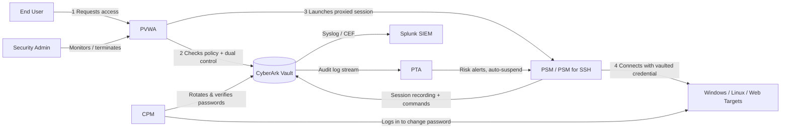

# CyberArk PAM (Self-Hosted v12.6): Privileged Session Monitoring, Auditing & Password Rotation Lab

*A hands-on home-lab project implementing session recording, dual control, live session monitoring, session analytics, automated password rotation, and SIEM-integrated auditing using CyberArk Privileged Access Manager (PAM) Self-Hosted v12.6.*

---

## Scenario

You're the newly hired PAM engineer at a mid-sized organization. A recent internal audit flagged several gaps in privileged access controls:

- Privileged RDP, SSH, and web admin sessions are **not recorded**, so there's no evidence trail if something goes wrong.
- Anyone with safe access can connect to a privileged account **without a second person's approval** or having to state *why* they need it.
- The security team has **no way to watch a live privileged session** or kill one that looks suspicious.
- Privileged passwords are **never rotated** — some have been unchanged for years.
- There is **no integration with the SIEM**, so the SOC has zero visibility into privileged account activity.

Your job: stand up CyberArk PAM Self-Hosted 12.6 and close every one of these gaps.

## Overview

This lab deploys the core CyberArk PAM Self-Hosted stack — **Vault, PVWA, CPM, PSM (RDP/SSH/Web), and PTA** — in an isolated lab network, onboards a mix of Windows, Linux, and web-application privileged accounts, then walks through five hands-on projects: full session recording with dual control and justification, live session monitoring and termination, session analytics for anomalous command detection, automated password rotation policies per account type, and SIEM-integrated auditing with custom reports.

## Tools & Components Used

- **CyberArk Vault** — the encrypted digital vault that stores all privileged credentials
- **PVWA (Password Vault Web Access)** — the web portal used to request access, monitor sessions, and run reports
- **CPM (Central Policy Manager)** — automatically rotates, verifies, and reconciles privileged passwords
- **PSM (Privileged Session Manager)** — proxies and records RDP, SSH, and web sessions so end users never see the real credentials
- **PSM for SSH** — the Linux/Unix-focused session manager component, also used for command-level logging
- **PTA (Privileged Threat Analytics)** — analyzes Vault and PSM activity for anomalous or risky behavior
- **Target systems** — Windows Server 2022 (local + domain admin accounts), Ubuntu Linux (root/SSH), a sample internal web app, and a SQL Server instance
- **Splunk (free/trial)** — SIEM used to ingest Vault audit events and trigger real-time alerts
- **PowerShell / Bash** — used for custom CPM verification scripts

## Lab Architecture

